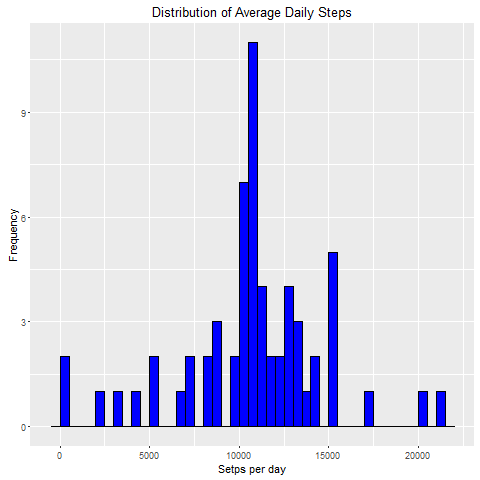
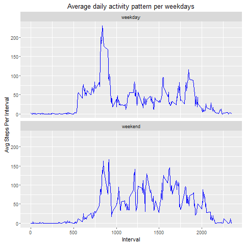

## Loading and preprocessing the data

This report makes use of data from a personal activity monitoring device. 
This device collects data at 5 minute intervals through out the day. 
The data consists of two months of data from an anonymous individual collected 
during the months of October and November, 2012 and include the number of steps 
taken in 5 minute intervals each day.

First of all enumerate the libraries needed to generate this report.

```r
library(dplyr)
library(ggplot2)
```

The piece of code shown above loads de dataset to be analysed.

```r
activity <- read.csv("activity.csv")
```

## What is mean total number of steps taken per day?

For this analysis the missing values will be ignored.

Because this dataset measures the number of steps collected at 5 minutes intervals 
it is interesting to calculate the total number of steps taken per day.

For this purpose the following piece of code calculates the total number of steps taken per day.

```r
stepsPerDayData <- activity %>% filter(!is.na(steps)) %>% group_by(date) 
	%>% summarise(stepsPerDay = sum(steps))
```

These are the first 10 rows of the data obtained above.

```r
Source: local data frame [53 x 2]

         date stepsPerDay
       (fctr)       (int)
1  2012-10-02         126
2  2012-10-03       11352
3  2012-10-04       12116
4  2012-10-05       13294
5  2012-10-06       15420
6  2012-10-07       11015
7  2012-10-09       12811
8  2012-10-10        9900
9  2012-10-11       10304
10 2012-10-12       17382
..        ...         ...
```

A histogram of the total number of steps taken each day is shown above.

 

The following piece of code calculates the mean and median of the total number of steps taken per day

```r
stepsPerDayData %>% summarise(meanStepsPerDay = mean(stepsPerDay), medianStepsPerDay = median(stepsPerDay))
```

These are the values calculated.

```r
  meanStepsPerDay medianStepsPerDay
            (dbl)             (int)
1        10766.19             10765

```

In conclusion, the mean of the total number of steps taken per day is **10766.19**.

## What is the average daily activity pattern?

For this analysis the missing values will be ignored.

To answer this question a new dataset is created with the mean daily activity grouped by 5-minute intervals by means of the following piece of code.

```r
stepsPerIntervalData <- activity %>% filter(!is.na(steps)) %>% group_by(interval) 
	%>% summarise(stepsPerInterval = mean(steps)) 
```

A time series plot of the 5-minute interval (x-axis) and the average number of steps taken, averaged across all days (y-axis), 
based on the dataset previously composed, is shown below, 

 

The following piece of code gets the 5-minute interval, on average across all the days in the dataset, that contains the maximum number of steps.

```r
stepsPerIntervalData[stepsPerIntervalData$stepsPerInterval == max(stepsPerIntervalData$stepsPerInterval), ]
```

The maximum average activity is located on **835** interval, i.e., 01:55 PM. 
The higher values of activity are located between the intervals 500 minutes and 2000 minutes.


## Imputing missing values

The following piece of code calculates the number of missing values of the original dataset.

```r
sum(!complete.cases(activity))
```

The number of missing values is **2304**.

The strategy for filling in all of the missing values in the dataset uses the mean for the 5-minute interval. 
The implementation is shown below.

```r
activityNoNAs <- activity
activityNoNAs$steps <- with(activityNoNAs, 
	mapply(function(x,y) ifelse(is.na(y), 
	stepsPerIntervalData[stepsPerIntervalData==x, ]$stepsPerInterval, y), interval,steps))
```

This implementation copies the original dataset, then, fill in all the missing values. 

With aims of calculates the total number of steps taken per day the following piece of code was implemented.

```r
stepsPerDayDataNoNAs <- activityNoNAs %>% group_by(date) %>%summarise(stepsPerDay = sum(steps))
```

A histogram of the total number of steps taken each day is shown above.

 

The following piece of code calculates the mean and median of the total number of steps taken per day

```r
stepsPerDayDataNoNAs %>%
	summarise(meanStepsPerDay = mean(stepsPerDay), medianStepsPerDay = median(stepsPerDay))
```

These are the values calculated.

```r
  meanStepsPerDay medianStepsPerDay
            (dbl)             (dbl)
1        10766.19          10766.19

```

The mean steps per day are the same as the dataset with the rows remove because of missing values. The median, in this case has the same value as the mean. 
The maximum frequency has increased respect to the dataset with the rows remove because of missing values. The number of steps of the maximum frequency has increased too.


## Are there differences in activity patterns between weekdays and weekends?

To answer the current question it is needed to create a new factor variable in the dataset with missing values imputed with two levels – “weekday” and “weekend” 
indicating whether a given date is a weekday or weekend day.

The following piece of code shows how to add this new variable.

```r
activityNoNAs$weekdays <- factor(sapply(as.Date(activityNoNAs$date), 
	function(x) ifelse(weekdays(x)%in% c("Saturday","Sunday"), "weekend", "weekday")))
```

Because of we are interested in plotting a time series figure of the 5-minute interval and the average number of steps taken a new dataset is required.
This dataset is obtained as follows.

```r
stepsPerIntervalDataNoNAs <- activityNoNAs %>% group_by(interval, weekdays) 
	%>%summarise(stepsPerInterval = mean(steps)) 
```
This new dataset allows us plotting time series figure of the 5-minute interval and the average number of steps taken shown below.

 

The figure above shows that the steps on weekends are lesser than on weekdays and the steps taken starts later on than on weekdays. 
This pattern shows a decrease respec to activity on weekends.
